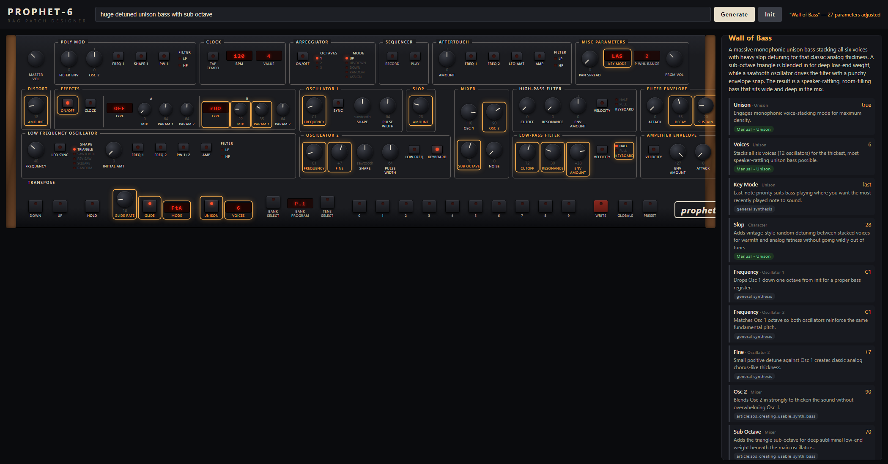

# Prophet-6 Patch Designer

*Describe a sound in plain English — "warm Juno-style chorus pad with slow movement" — and get a
real, playable Sequential Prophet-6 patch: every knob and switch set on a faithful on-screen front
panel, each move traced to the source that justified it, ready to send to the hardware over MIDI.*

Under the hood it's a retrieval-augmented generation (RAG) system for one synthesizer, built on a
single principle: **generation is grounded in a curated corpus and measured against an ungrounded
baseline at every step.**

## Thesis

Base LLMs answer fluently but unreliably on hardware-specific synth knowledge — parameter behavior,
menu paths, community-discovered fixes, patch recipes. This system grounds every patch and answer in
a curated Prophet-6 corpus (the official manual, community threads, decoded factory patches, tutorial
transcripts) and treats **evaluation as a first-class deliverable**: nothing ships on vibes; each
change is kept or rejected on a measured number.

## What it does

**Patch creation — the main capability.** Open the Studio, type a sound, and the system designs a
complete patch and animates it onto a hardware-accurate panel, knob by knob.



- **Grounded, and honest about it.** A sidebar explains every change and badges its provenance — a
  **manual** / **reddit** / **patch** corpus citation, or an honest `general synthesis` tag when the
  move came from the model's own knowledge rather than the corpus. You can see exactly how much of a
  patch is backed by real Prophet-6 facts.
- **A faithful front panel.** 86 parameters across 17 sections, laid out to match the real desktop
  module — the control bands, HPF above LPF, LED destination pairs, red 7-segment displays using the
  manual's actual codes (`bbd`, `CHO`, `FR`…). Every value is validated and clamped server-side; an
  out-of-range or unknown parameter never reaches the panel.
- **Send it to hardware.** A MIDI toggle pushes the patch to a connected Prophet-6 as an edit-buffer
  dump — loads instantly, never overwrites a saved program. The sysex encoder is the exact inverse of
  the decoder (`decode(encode(p)) == p` across all 771 patches), and the FX byte mappings were
  confirmed against real hardware captures (see `docs/KNOWN_ISSUES.md`).
- **Save & load presets.** Name and store patches you like, then reload them — or push them straight
  to the hardware — later.

**Grounded Q&A (secondary).** `python src/generate/ask.py "what does slop do?"` answers Prophet-6
questions with inline citations, and says *"my corpus doesn't cover this"* rather than inventing specs.

## How it works — the pipeline

```
acquire  →  chunk  →  embed + index  →  retrieve  →  ground  →  generate  →  validate
raw sources  chunks.jsonl  BGE vectors    hybrid       real        schema-      clamp to
(manual,     (the          + BM25         search +     factory     constrained  the panel's
 reddit,      contract)                   diversity    patches as  JSON         real ranges
 patches…)                                             exemplars
```

Each stage reads what the previous one wrote; `data/chunks/chunks.jsonl` is the contract between
processing and indexing. The patch path specifically:

1. **Retrieve** the most relevant chunks for the sound, fusing meaning-based (BGE embeddings) and
   keyword (BM25) search, with a diversity guarantee so the model sees the manual *and* community
   *and* a real patch — not three near-duplicates.
2. **Ground** — load the full settings of any retrieved factory patches so the model *adapts a
   known-good patch* instead of guessing from scratch (decisions.md D-024).
3. **Generate** — the LLM (Claude) writes a JSON patch constrained to the panel schema, citing a
   source for each change.
4. **Validate** — clamp/coerce every value to the synth's legal ranges before it reaches the panel.

The parameter schema (`src/ui/patch_schema.py`) does triple duty — it's the LLM's contract, the
server-side validator, *and* the panel layout — so the three can never drift apart.

**Corpus** (rebuildable, not bundled — see below): **25,544 chunks** — 24,000 reddit Q&A +
r/synthrecipes, 766 decoded factory/OMOM patches, 607 articles (incl. the complete Synth Secrets
series), 92 manual/addenda, 52 video transcripts, 15 cross-synth translations, 12 official-KB.

## Measured

The evaluation harness (`eval/`) was defined *before* the pipeline was built, and every retrieval
change was kept or removed on a number — including the negative results:

- **Retrieval recall@5: 0.90 → 0.95.** Hybrid BM25+vector fusion closed lexical gaps on jargon-heavy
  queries; a source-diversity guarantee recovered keyword-flooding regressions. Two textbook
  techniques were **measured and removed** for hurting this small, domain-tight corpus: LLM query
  decomposition (diluted the fused pool) and cross-encoder reranking (no gain over fusion).
- **Grounded beats ungrounded.** In a blind, position-randomized, citation-stripped judge comparison,
  RAG wins where hallucination concentrates — **11/11 factual queries**. (The base model insisted
  vintage mode "comes with every unit right out of the box"; it actually shipped years later in OS
  1.6.7.)
- **Faithfulness ~93% at the claim level**, with contradictions rare — failures are overwhelmingly
  *true-but-ungrounded* glue facts, not inventions.
- **The patch designer adapts real, named factory patches** instead of inventing values; corpus-cited
  provenance rose ~2.7× over the prose-only Q&A baseline.

Per-bucket tables and honest post-mortems live in `eval/results/*.json` and
`eval/failure_analysis_*.md`. (One example of the measurement ethos: a pre-cleanup corpus scored a
flattering 1.000 recall; removing ~180 junk chunks dropped it to 0.95 — two "hits" had been riding on
troll answers. The cleanup cost points and was correct anyway.)

## Observability dashboard

A local dashboard at `/dash.html` for debugging and improving patch accuracy: **replay any generation
stage-by-stage** (retrieval pool → grounding → LLM output → validation → provenance), **diff eval
runs** to catch regressions before they ship, and inspect **corpus coverage gaps**. Built for
developers new to RAG — every metric carries a plain-English hover explainer. Same stdlib server, no
new dependencies. Design: `docs/OBSERVABILITY_PLAN.md`.

## Run it

```bash
pip install -r requirements.txt          # numpy, sentence-transformers, anthropic, …
cp .env.example .env                     # set ANTHROPIC_API_KEY  (Windows: copy)

python src/ui/server.py                  # then open:
#   http://127.0.0.1:8765/studio.html    — the patch designer
#   http://127.0.0.1:8765/dash.html      — the observability dashboard
```

Patch generation and Q&A need `ANTHROPIC_API_KEY` + internet; the dashboard, MIDI capture, and presets
work offline. The first generation loads the embedding model (~30 s); after that it's retrieval + one
LLM call.

**Rebuild the corpus from scratch** (re-fetches public sources, records URL + date provenance):

```bash
python src/acquire/fetch_official.py     # manual + knowledge base
python src/acquire/fetch_reddit.py       # community threads
python src/acquire/fetch_articles.py     # recipe literature
python src/process/build_chunks.py       # → data/chunks/chunks.jsonl
python src/index/build_index.py          # → BGE embeddings + index
python src/evaluate/recall.py production 5 strat+div   # measure
```

## Data, licensing & reproducibility

**The corpus is reproducible, not bundled.** The ~1.3 GB of raw sources, chunks, and embeddings under
`data/` are **not committed — by policy, not omission:**

- **Licensing.** A register in `decisions.md` (D-021/D-023/D-025) marks several sources
  *private-corpus-only* (decoded patch data, article HTML, video captions) and excludes others outright
  (a commercial cookbook, paywalled magazines). The manual PDF and reddit content aren't ours to
  redistribute.
- **Size & signal.** The corpus is the project's *input*; the engineering and measurement are the
  deliverable.

What's in the repo: all pipeline code (`src/`), the full decision log, the eval harness, the golden
query sets (`eval/golden_set*.jsonl`), and the results (`eval/results/*.json`). The acquisition scripts
rebuild the corpus from the original public sources.

## Further reading

Describe a sound ("warm Juno-style chorus pad with slow movement") and the system designs a
Prophet-6 patch: corpus retrieval (production `hybrid+div` mode) feeds an LLM constrained to
a front-panel schema of 82 parameters across 17 sections — every parameter name, range, and
switch position extracted from the manual chunks. The panel is laid out to match the real
hardware (desktop module, from a reference photo): the four control bands, Mixer spanning
two rows, HPF above LPF, FILTER LP/HP destination LED pairs, Half/Full keyboard-tracking
LEDs, red 7-segment displays using the manual's actual display codes (`bbd`, `CHO`, `FR`,
`LO`…), and the bottom switch row (Hold, Glide, Unison, program buttons). The panel starts
from INIT, then
turns each adjusted knob into place one-by-one, leaving it highlighted, with a sidebar
explaining every change and badging its provenance: **manual** / **reddit** chunk citation,
or an honest `general synthesis` tag when the move comes from the model's own synthesis
knowledge rather than the corpus. Values are validated and clamped server-side
(`src/ui/patch_schema.py`); unknown parameters and out-of-range values never reach the panel.
Direct-link a sound with `http://127.0.0.1:8765/?q=aggressive+hard+sync+lead`.
Design rationale and the loosened grounding contract: decisions.md D-020.

**MIDI out (D-030).** A header `MIDI ON/OFF` toggle pushes the generated patch to a
connected Prophet-6 as a single sysex **edit-buffer dump** (loads instantly, never
overwrites a saved program — Write it on the hardware to keep it). The encoder
(`src/patches/encode_sysex.py`) is the exact inverse of the patch decoder;
`decode(encode(p)) == p` for all 771 patches. Transport is the browser-native Web MIDI
API (Chrome/Edge), so no server round-trip or new dependencies. The patch loads up-front
while the on-screen animation plays purely for visual effect. Sending a patch and hearing
whether the filter actually moves is also how the reverse-engineered selector orders
(D-023) finally get confirmed on hardware — that listening test is the one open gate.

## Results

Retrieval recall@5, 41 golden queries, final QA'd corpus (1,192 chunks):

| Run | Overall | B1 factual | B2 recipes | B3 cross-synth | B4 troubleshooting | Verdict |
|---|---|---|---|---|---|---|
| Vector only (baseline) | 0.902 | 1.00 | 0.80 | 0.80 | 1.00 | — |
| + Hybrid BM25/RRF (D-011) | 0.927 | 1.00 | 0.90 | 1.00 | 0.80 | kept |
| + Source-diversity guarantee (D-016) | **0.951** | 1.00 | 0.90 | 1.00 | 0.90 | **kept — production** |
| LLM query rewriting (D-017) | 0.902* | 1.00 | 0.90 | 0.80 | 0.90 | removed (hurt) |
| Cross-encoder rerank (D-018) | 0.951* | 1.00 | 1.00 | 0.90 | 0.90 | removed (no gain) |

\* measured on the pre-QA corpus where hybrid+div scored 1.000; relative ordering is what
mattered for the keep/remove decision.

What moved the numbers: hybrid BM25 closed the lexical gap on jargon-heavy misses (Juno-chorus
emulation, patch-programming resources); the source-diversity guarantee (top-5 must include an
official and a community chunk when available) recovered keyword-flooding regressions on
troubleshooting queries. What didn't: LLM query decomposition — the plan's predicted headline
technique — *diluted* the fused pool on this small, domain-tight corpus, and a MiniLM
cross-encoder reordered no better than the fusion ranking. Both documented and removed.

An honest-measurement note: pre-QA, hybrid+div scored a flattering 1.000. The mandatory chunk
QA loop then removed ~180 junk chunks (troll answers, OP self-promo, duplicate comment copies)
and the score settled at 0.951 — two pre-QA "hits" had been riding on junk. Cleanup cost
recall points and was correct anyway.

### End-to-end results (Phase 6, claude-sonnet-4-6 generation + judging)

**Answer faithfulness** (claim-level LLM judge, validated by a human spot-check protocol):

| Measure | Score |
|---|---|
| Strict answer-level (every claim supported) | 53.7% (22/41) |
| Claim-level support (30 unsupported of 456 claims) | **93.4%** |
| Contradicted-by-source claims | **0** |

The strict number is dominated by *true-but-ungrounded* glue knowledge (correct general synth
facts not present in the retrieved chunks — e.g. "the P6 has a knob-per-function layout").
Failures are additions, never contradictions. Full classification: `eval/failure_analysis_v1.md`.

**RAG vs. ungrounded base model** (blind pairwise judge, position-randomized, citations stripped):

| Bucket | RAG wins | Base wins | Tie |
|---|---|---|---|
| B1 factual/manual | **11** | 0 | 0 |
| B2 recipes | 3 | 7 | 0 |
| B3 cross-synth | 4 | 6 | 0 |
| B4 troubleshooting | 5 | 5 | 0 |
| **Total** | **23 (56%)** | 18 | 0 |

The split is the finding: grounding wins everywhere hallucination risk is concentrated
(factual lookups: 11/11 — e.g. the base model confidently claimed vintage mode "comes included
with every unit right out of the box"; it shipped years later in OS 1.6.7), while the base
model's broad fluency wins open-ended recipe advice where the corpus holds one narrow community
answer. That points the v2 acquisition roadmap at tutorial-depth content, not more threads.

### Example: confident hallucination vs. grounded answer

> **Q: "Does the Prophet 6 come with vintage mode installed if I buy it new?"** (b1-q06)
>
> **Base model:** "**Yes** — Vintage Mode is a standard built-in feature of the Prophet-6. It
> comes included with every unit right out of the box, no additional purchase or installation
> required." ❌ *(invented; vintage mode arrived in firmware OS 1.6.7, years post-launch)*
>
> **This system:** "It depends on when the unit was manufactured … Vintage mode is part of the
> firmware (introduced in OS v1.6.7), so even if your unit doesn't have it, you can easily
> update yourself [reddit:ozu0ll]" ✓ — and the refusal path holds up the other way: asked about
> the P6's CV outputs (it has none), the system answers "My corpus doesn't cover this" instead
> of inventing specs.

## What didn't work (kept honest, from decisions.md)

1. **LLM query decomposition** (D-017) — the plan's predicted headline technique for
   cross-synth queries. Measured: recall@5 *dropped* 0.976 → 0.902; sub-queries dilute the
   fusion pool on a small, domain-tight corpus. Removed.
2. **Cross-encoder reranking** (D-018) — MiniLM reranker reordered no better than the
   BM25+vector fusion ranking (0.951 vs 1.000 pre-QA). Removed.
3. **Reddit acquisition met reality** (D-015) — 7 original golden targets turned out to be
   *permanently unrecoverable* (threads deleted before any archive captured their comments).
   The eval was repaired with reachable replacements and an integrity check now guards every
   rebuild. The corollary finding: pullpush comment coverage is spotty, and old.reddit HTML
   scraping was the necessary fallback for 17 threads.
4. **Junk chunks inflate recall** — the chunk-QA loop (troll answers at score −14, OP
   self-promo, duplicated pre/post-edit comment copies) cost ~5 recall points and was correct.

Notable acquisition finding (decisions.md D-015): 7 original golden targets turned out to be
*permanently unrecoverable* — threads deleted from reddit before their comments were archived.
Eval repaired with reachable real-query replacements; `check_targets.py` now guards eval
integrity on every rebuild.

Corpus: 1,369 chunks (1,146 reddit Q+A pairs from 139 threads, 92 manual/addenda sections,
119 article, 12 official-KB).

---

# v2 — The Recipe Knowledge Base (2026-06-12)

v2 executed `prophet6_rag_v2_plan.md`: convert the Q&A corpus into a comprehensive,
*measured* synth-recipe knowledge base. Corpus grew 5×, with structure where v1 had prose:

| Source | Chunks | What it is |
|---|---|---|
| reddit | 4,689 | v1 P6-subreddit Q+A pairs + top-600-engagement r/synthrecipes threads (full 36,113-submission archive swept) |
| patch | 766 | **all 770 official factory/OMOM programs, decoded from sysex** (round-trip 770/770; names vs official PDFs 98.2%; layout reverse-engineered — decisions.md D-023) |
| article | 607 | v1 articles + the complete 64-part Synth Secrets series |
| manual / official_kb | 104 | unchanged from v1 |
| video | 52 | recipes extracted from 31 captioned P6 tutorial videos (transcript-only, timestamped links) |
| translation | 15 | hand-curated cross-synth table: Juno/Minimoog/DX7/CS-80/… → P6 realizations, with anti-claim caveat rows |
| **total** | **6,233** | |

**Retrieval evolved under fire.** The v1-recall tripwire fired after three of four
ingestion waves, each a different diagnosable disease: BM25 IDF drift (fixed:
**source-stratified BM25**, D-024), same-document crowding (fixed: **one chunk per
document**, D-027 — briefly lifting recall to 0.976, *above* the v1 baseline), and
community-vocabulary flooding (fixed: **per-community reddit lanes**, D-029). A fourth
technique (evict-lane-redundant diversity slots) was measured, hurt, and removed.

## v2 results

| Measure | Result | v1 comparison |
|---|---|---|
| v2 golden recall@5 (85 queries) | **0.953** — B2 recipes **55/55**, B3 cross-synth **12/12**, B5 recreate 14/18 | n/a (new set) |
| v1 tripwire recall@5 | 0.902 — 4 misses, all *eval-staleness*: newer sources (e.g. the translation table's Juno entry at rank 0) outrank 2025-era targets that can't credit them (D-029) | 0.951 |
| Patch-grounded vs pure-LLM designer (blind A/B) | **adapt 14 – 11** — kept as production | n/a |
| Designer provenance (corpus-cited changes) | **45.8%** (234/511; video 98, patch 52, reddit 47, translation 27) | ~17% |
| Patch parameter accuracy (18 recreate-probes) | 0.509 active / 0.701 overall — named-reference probes hit 0.75–0.88 | n/a (new metric) |
| Faithfulness (claim-level) | **93.8%** (61 unsupported of 981; 6 contradicted — spot-check pending) | 93.4% (0 contradicted) |
| Faithfulness (strict answer-level) | 60.0% | 53.7% |
| Bake-off vs base model | RAG 40 – 45 (B2 25–30, **B3 7–5**, B5 8–10) — **headline suppressed by a measured judge artifact**: the citation-stripper missed v2 `[patch:…]` labels; 10 "base" verdicts explicitly call the RAG answer's *true* factory-preset references fabricated (`eval/failure_analysis_v2.md` §3) | RAG 23 – 18 (B1-heavy) |
| Coverage matrix | **100%** of 76 cells ≥ 3 independent sources | n/a |

### Success criteria (stated in the plan before any acquisition)

| # | Criterion | Verdict |
|---|---|---|
| 1 | B2 bake-off flips to majority-RAG; B3 ≥ parity | **B3 PASS** (7–5); **B2 FAIL as measured** (25–30) — with the documented judge artifact: 10 wrong-basis verdicts would flip the total to RAG-majority; re-judge is a builder item |
| 2 | Majority of designer changes corpus-cited | **FAIL-close: 45.8%** (2.7× v1; concentrated misses are low-stakes "glue" settings) |
| 3 | v1 recall ≥ 0.95 after every wave | **FAIL: 0.902** — held through waves 1–2 via two new techniques; wave-3 misses are adjudicated eval-staleness, not dilution (D-029: builder decides re-target vs freeze) |
| 4 | ≥ 90% coverage cells with ≥ 3 sources | **PASS: 100%** |

An honest scoreboard: one clean pass, one split, two fails each with a measured cause and
a concrete builder path — not narrative excuses. The strongest v2 facts: recipe and
cross-synth retrieval at 1.00 on the purpose-built golden set, provenance up 2.7×, and a
patch designer that adapts real, named factory patches instead of inventing values.

### Open items for the builder (gates passed provisionally per D-021)

1. **Hardware spot-check** (D-023): load ~10 decoded patches on the P6; verify panel
   values + selector orders (the one gate only you can run).
2. **Judge re-check** (new): fix `strip_citations` for `[patch:…]` labels, re-judge the
   B5/B2 bake-off, spot-checking the judge verdicts (incl. the 6 contradicted claims).
3. **v1 eval adjudication** (D-029): extend the 4 stale v1 entries' targets, or freeze.
4. **Reviews**: coverage matrix (D-022), translation table (D-026), video extractions
   (`eval/video_extraction_report.md`), patch-chunk QA (`eval/chunk_qa_patches_verdicts.md`).
5. **Ratify D-021…D-029.**
6. **Overnight full-thread run** (optional): `fetch_synthrecipes_threads.py 5000 N 3` ×3,
   then re-chunk → merge → index → tripwire.

Plan: [prophet6_rag_v2_plan.md](prophet6_rag_v2_plan.md) · Failure analysis:
[eval/failure_analysis_v2.md](eval/failure_analysis_v2.md) · Concepts:
[decisions.md](decisions.md) (entries D-021…D-029).

## Status

- [x] Phase 0 — repo skeleton, metrics, golden dataset *(pending human ratification at Gate 1)*
- [x] Phase 1 — data acquisition (manual PDF + addenda + KB, 170 reddit threads, 16 articles)
- [x] Phase 2 — chunkers + `chunks.jsonl` *(code done; human stranger-test QA gate pending)*
- [x] Phase 3 — index + recall baseline recorded
- [x] Phase 4 — retrieval layer: 4 techniques measured, 2 kept, 2 removed as negative results
- [x] Phase 5 — generation with citations; refusal path verified on out-of-corpus queries
- [x] Phase 6 — faithfulness + bake-off run; failure analysis drafted *(judge spot-check + classification review pending builder)*
- [x] Phase 7 — case study write-up (this README)

**Open items for the builder (per D-019, gates were assistant-drafted for v1):** review
the ~15 sampled judge verdicts, revise `eval/failure_analysis_v1.md`
classifications, and ratify the post-waiver decision entries D-016–D-019.

Design decisions and rejected alternatives: see [decisions.md](decisions.md) — the engineering
log, with every decision, the alternatives rejected, and the measured outcome.

Next: [prophet6_rag_v2_plan.md](prophet6_rag_v2_plan.md) — the v2 plan for a comprehensive,
measured synth-recipe corpus (structured patches, recipe literature, cross-synth translation
table, video mining, audio-grounded eval).
